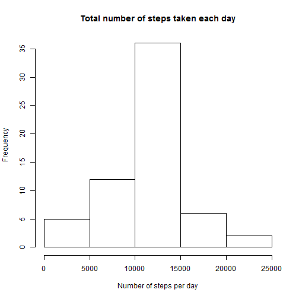

This report takes data from a personal activity monitoring device and answers a 
series of questions listed below.  The device collects data at 5 minute intervals through out the day. The data consists of two months of data from an anonymous individual collected during the months of October and November, 2012 and include the number of steps taken in 5 minute intervals each day.


## Load the data

First, download the data manually from the website, store it in the local working directory and load the data into R


```r
        filename <- "activity.csv"
        rawdata <- read.csv(filename,
                         header = TRUE,
                         sep = ",",
                         na.strings= "NA")
```

Take a look at the data sample 


```r
        head(rawdata, n=6L)
```

```
##   steps       date interval
## 1    NA 2012-10-01        0
## 2    NA 2012-10-01        5
## 3    NA 2012-10-01       10
## 4    NA 2012-10-01       15
## 5    NA 2012-10-01       20
## 6    NA 2012-10-01       25
```


## Pre processsing

Create a tidy data set
Convert the date and interval to date time format and store in a seprate field
drop the date and time


```r
        tidydata <- rawdata
        ## add the datetime column
        ## use the sprintf function to add leading 0 to interval
        tidydata$datetime <- strptime(paste(tidydata$date, 
                                sprintf("%04d", tidydata$interval)), 
                        format = "%Y-%m-%d %H %M")
        
        ## remove date and interval
        ## tidydata$date <- NULL
        ## tidydata$interval <- NULL
```
 

Take a look at the tidy data 
        

```r
        head(tidydata, n=6L)
```

```
##   steps       date interval            datetime
## 1    NA 2012-10-01        0 2012-10-01 00:00:00
## 2    NA 2012-10-01        5 2012-10-01 00:05:00
## 3    NA 2012-10-01       10 2012-10-01 00:10:00
## 4    NA 2012-10-01       15 2012-10-01 00:15:00
## 5    NA 2012-10-01       20 2012-10-01 00:20:00
## 6    NA 2012-10-01       25 2012-10-01 00:25:00
```

##What is the mean total number of steps taken per day

Now calculate the mean total number of steps taken per day

First get the sum of steps per day and calculate the mean and median 


```r
        tidydata_noNA <-na.omit(tidydata)

        dayStepSum <- tapply(tidydata_noNA$steps, 
                tidydata_noNA$date, 
                sum)
                
        stepsPerDayMean <- mean(dayStepSum, na.rm = TRUE)
        stepsPerDayMedian <- median(dayStepSum, na.rm = TRUE)
```
        
Then plot it        


```r
        hist(dayStepSum,  
             main = "Total number of steps taken each day", 
             xlab = "Number of steps per day")
```

 

### The mean of the total number of steps per day is 10766.19
### The median of the total number of steps per day is 10765


## What is the average daily activity pattern?

Now calculate the average and the maximum


```r
        intervalStepMean <- tapply(tidydata_noNA$steps, 
                                   tidydata_noNA$interval,
                                   mean)
        ##Get the max value and find the column name to get the max interval
        maxInterval <-  names(intervalStepMean
                                [intervalStepMean == max(intervalStepMean)])
```

And plot 


```r
plot(x=names(intervalStepMean), y=intervalStepMean, type = 'l', main = "Average daily activity pattern", xlab="5 Minutes Interval", ylab = "Average number of steps")
```

 


The **maximum** 5 min interval on average across all the days is 835

## Imputing missing values

Calculate the total number of missing values


```r
        numNARows <- nrow(tidydata[is.na(tidydata$steps),])
```
    
The total number of missing values in the dataset is **2304**


A strategy for imputing missing values is imputing the mean of the interval over all the days for the same 5 min interval. 
    

```r
        tidydata_impNA <- tidydata

        ## interval step mean has 288 rows at 5 min interval
        ## The NA data is also in multiples of 288. ie it is not there 
        ## for some whole days. Total value is 2308 = 288 *8
        ## So we can assign the inteval step mean data.
        ## R automatically replicates 288 rows 8 times and assigns
        ## note that this creates dependency of the NA appearance in raw data
        ## if some of the intervals in part of day alone are NA,
        ## then this strategy will not work

        tidydata_impNA[is.na(tidydata_impNA$steps),]$steps <- intervalStepMean
```

Imputed data set is ready.  Now calculate the total number of steps taken each day


```r
        dayStepSum_imp <- tapply(tidydata_impNA$steps, 
                                tidydata_impNA$date, 
                                sum)
                
        stepsPerDayMean_imp <- mean(dayStepSum_imp)
        stepsPerDayMedian_imp <- median(dayStepSum_imp)
```

Then plot it        


```r
        hist(dayStepSum_imp,  
             main = "Total number of steps taken each day", 
             xlab = "Number of steps per day")
```

 

### The mean of the total number of steps per day is 10766.19
### The median of the total number of steps per day is 10766.19

After imputing, the mean remains same as before but the median is now increased
and has become same as mean

The total daily number of steps also does not change

## Are there differences in activity patterns between weekdays and weekends?

First add a column to the dataframe to identify if weekday or weekend
Then calculate the means for weekend and weekdays


```r
        tidydata_impNA$weekendId <- ifelse((
                        weekdays(tidydata_impNA$datetime)  == "Saturday" | 
                        weekdays(tidydata_impNA$datetime)  == "Sunday"),
                                        "weekend", 
                                        "weekday")

        
        tempdf <- tidydata_impNA[tidydata_impNA$weekendId == "weekend", ]

        intervalStepMeanWkend <- tapply(tempdf$steps,
                                   tempdf$interval,
                                   mean)

        tempdf <- tidydata_impNA[tidydata_impNA$weekendId == "weekday", ]

        intervalStepMeanWkday <- tapply(tempdf$steps,
                                   tempdf$interval,
                                   mean)
```

And plot it


```r
        par(mfrow = c(2,1), mar = c(4,4,1,2))

        ## Weekend plot at the top
        
        plot(x=names(intervalStepMeanWkend), 
             y=intervalStepMeanWkend, 
             type = 'l', 
             xlab="", 
             ylab = "number of steps")

        title(main = "Weekend", col = c("red"))

        ## legend(x = "top",
        ##       fill = c("pink"),
        ##       legend = "Weekend")
        
        ## x.intersp = 0.05,

        ## weekday plot at the bottom

        plot(x=names(intervalStepMeanWkday), 
             y=intervalStepMeanWkday, 
             type = 'l', 
             xlab="Interval", 
             ylab = "number of steps")

        title(main = "Weekday", col = c("red"))
```

 

